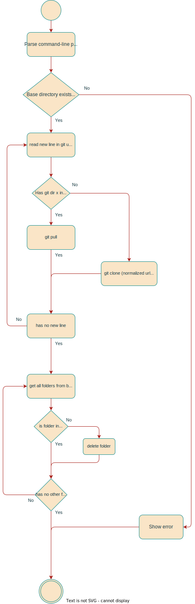
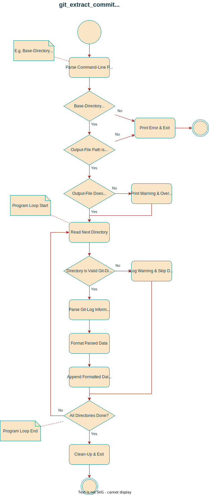

# Projekt Dokumentation

Erstellt am 24.06.2022.

## Lösungsdesign

Anhand der Analyse wurde folgendes Lösungsdesign entworfen.

### Syntax

Kommandozeilen-Beispiele sehen wie folgt aus:

```bash
# root-befehl <argumente>
$ non-root-befehl <argumente>
```

Befehlen, die `root`-Berechtigungen benötigen, wird ein `#` anstatt ein
`$`-Symbol vorangesetzt. Das `#`- oder `$`-Zeichen dienen lediglich fürs
visuelle Verständnis, und gehört nicht zum eigentlichen Befehl hinzu.

Weiter weisen eckige Klammern `[...]` auf optionale Argumente hin, `<...>`
gelten als Platzhalter:

```bash
$ kommando [<input-file>]
```

### Aufruf der Skripte

Es wird in folgender Reihenfolge (Priorität) nach Konfigurationen gesucht:

- Kommandozeilenargumente
- Environment Variables
- --config <FILE_PATH>
- $PWD/m122.env
- $XDG_CONFIG_HOME/m122/m122.env
- $HOME/.config/m122/m122.env
- Standardwerte

Kommandozeilen-Optionen nehmen immer Priorität.

#### Git Clone/Update Repos

```bash
$ git_clone_update_repos.bash <ARGUMENTE> <INPUT_FILE>
```

Repositories werden von dem `BASE_DIRECTORY` gelesen. Dieses Verzeichnis könnte
zum Beispiel so aussehen:

```
$BASE_DIRECTORY/
├── M122_LB1/
├── M122_LB2/
├── Project1/
└── Project2/
```

... wobei jeder der Subordner ein Git-Repository darstellt.

> Sollte ein Git-Repository Verzeichnis im BASE_DIRECTORY existieren, jedoch nicht über das INPUT_FILE mitgegeben werden, so wird das Verzeichnis gelöscht.

| Short Flag (-) | Arguments           | Description                                                                |
| -------------- | ------------------- | -------------------------------------------------------------------------- |
| b              | Verzeichnis         | Setzt das `BASE_DIRECTORY`, in welchem sich die Git-Repositories befinden. |
| v              | Optionales Loglevel | Das Loglevel, standardmässig D, überschreibt `$LOG_LEVEL`.                 |

#### Git Extract Commits

```bash
$ git_extract_commits.bash <BASE_DIRECTORY> [-o <OUTPUT_FILE>] [<ARGUMENTE>]
```

Repositories werden von dem `BASE_DIRECTORY` gelesen. Dieses Verzeichnis könnte
zum Beispiel so aussehen:

```
$BASE_DIRECTORY/
├── M122_LB1/
├── M122_LB2/
├── Project1/
└── Project2/
```

... wobei jeder der Subordner ein Git-Repository darstellt.

Das `OUTPUT_FILE` wird als Space-Separated CSV nach folgendem Format
geschrieben:

```
<Zielverzeichnis>,<YYYYmmdd>,<Author>,<Commit-Hash>
```

Die Datei beginnt immer mit diesem Header als erster Zeile:

```
Zielverzeichnis,Datum,Commit-Hash,Author
```

Sollte das `OUTPUT_FILE` bereits existieren, wird es überschrieben, ausser die
Konfigurationsoption `OVERWRITE` ist gesetzt als `"No"` oder `"Ask"`. Folgende
Parameter können als Flaggen übergeben werden.

| Long Flag (--) | Short Flag (-) | Arguments           | Description                                                               |
| -------------- | -------------- | ------------------- | ------------------------------------------------------------------------- |
| help           | h              |                     | Hilfe ausgeben                                                            |
| version        |                |                     | Version ausgeben                                                          |
| config         |                | Dateipfad           | Die zu verwendende Konfigurationsdatei.                                   |
| output         | o              | Verzeichnis         | Die Ausgabedatei, überschreibt `$EXTRACT_OUTPUT` der Konfigurationsdatei. |
| verbose        | v              | Optionales Loglevel | Das Loglevel, standardmässig D, überschreibt `$LOG_LEVEL`.                |

### Exit Codes

Bei erfolgreicher Ausführung beträgt der Exit Code `$?` 0.

| Exit Code | Description                  |
| --------- | ---------------------------- |
| 0         | Erfolgreich                  |
| 1         | Invalide Argumente           |
| 2         | Fehlende Berechtigungen      |
| 3         | Fehlende Konfigurationsdatei |
| 255       | Andere Fehler                |

### Ablauf der Automation

#### Prozess für Git Clone/Update Repos:



#### Prozess für Git Extract Commits:



### Konfigurationsdateien

Das Konfigurationsfile muss den Namen `m122.env` tragen und sollte sich
entweder unter `$XDG_CONFIG_HOME/m122/`, `$PWD`, oder `$HOME/.config/m122/` befinden.

Die Konfiguration wird mit Bash-Syntax geschrieben. Das laufende Program
`source`d das Konfigurationsfile wenn vorhanden. Dabei werden alle Befehle in
der Konfig auch ausgeführt.

| Env Var        | Default Value | Possible Values    | Description                                                 |
| -------------- | ------------- | ------------------ | ----------------------------------------------------------- |
| EXTRACT_OUTPUT | $PWD          | Any file path      | Pfad für das Output-File von `git_extract_commits.bash`.    |
| LOG_LEVEL      | W             | D, I, W, E         | Ausführlichkeit des Logging.                                |
| OVERWRITE      | "Yes"         | "Yes", "No", "Ask" | Ob Ausgabedateien überschrieben werden sollten, oder nicht. |

Alternativ kann die Environment auch manuell beim Skript-Aufruf gesetzt werden:

```bash
LOG_LEVEL=D git_extract_commits.bash .local/src/
```

## Abgrenzungen zum Lösungsdesign

Gemäss Lösungsdesign umgesetzt.
